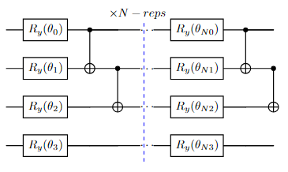
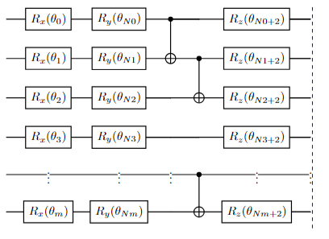
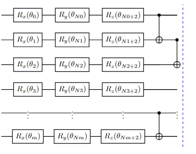
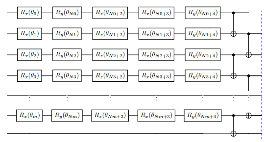

# **Qlassify: Quantum Variational Classifier**

**Qlassify** is a quantum computing assignment project where I built a custom **Variational Quantum Classifier (VQC)** using Qiskit. The idea behind this project is to explore how different quantum circuits (ansätze) and feature maps perform on classification tasks using real world datasets. It’s a fun dive into quantum machine learning, and I’ve added some custom twists with my own quantum circuit designs.


## **Features**
- **Custom Quantum Circuits (ansätze)**: I designed four different ansatz circuits (you'll see diagrams for them below) with varying gate setups.
- **Feature Maps**: I used both **ZZFeatureMap** and **PauliFeatureMap** to map classical data to quantum states.
- **Repetitions**: Each ansatz was tested with 1, 2, and 3 repetitions to see how deeper circuits affect performance.
- **Performance Metrics**: Evaluated the models on accuracy, precision, recall, and F1 score, while also keeping track of computation time.

---

## **Project Structure**
1. **Data**: The project uses two datasets:
   - **Statlog Heart** dataset (8 qubits)
   - **Ionosphere** dataset (12 qubits)
   
   Features were selected based on correlation with the target class, ensuring that the number of qubits stays manageable.

2. **Ansatz Circuits**:
   I built four custom quantum circuits (called **ansatz**) for this project. Each ansatz has a unique structure and different gate configurations. The diagrams below will give you an idea of how each one works:
   
   - **Ansatz 1**: Simple R<sub>y</sub> rotations with *CNOT* entanglements.
   - **Ansatz 2**: R<sub>x</sub> , R<sub>y</sub> , and R<sub>z</sub>  rotations with entanglement.
   - **Ansatz 3**: Similar to Ansatz 2, but tested separately for comparison.
   - **Ansatz 4**: More complex with extra rotations and circular entanglement.

3. **Quantum Classifier**:
   I used Qiskit’s **Variational Quantum Classifier (VQC)**, which pairs a feature map with one of the custom ansatz circuits. The optimizer I used was **COBYLA** with a max iteration of 25 to keep training efficient.

4. **Experiments**:
   Each ansatz was tested with both feature maps (ZZ and Pauli) and up to 3 repetitions. I logged the performance metrics for each configuration and compared how well they did (check `results/`: on maximum qubits but on a small sample of data and `results_2` folder: on less qubits but on full data).


## **Custom Ansätze**  
These diagrams will give you a visual sense of how the circuits are structured (*CNOT* gates may be represented incorrectly).

#### [Asantz 1](https://github.com/Ashad001/Qlassify/blob/main/src/ansatz.py#L04-L13) 

#### [Asantz 2](https://github.com/Ashad001/Qlassify/blob/main/src/ansatz.py#L15-L27) 

#### [Asantz 3](https://github.com/Ashad001/Qlassify/blob/main/src/ansatz.py#L29-L40) 

#### [Asantz 4](https://github.com/Ashad001/Qlassify/blob/main/src/ansatz.py#L42-L57) 



## **Results**  

<table>
  <tr>
    <td></td>
    <td></td>
  </tr>
  <tr>
    <td></td>
    <td></td>
  </tr>
</table>

---

## **How to Run**
1. Fork and Clone the repository:
   ```bash
   git clone https://github.com/{yourusername}/Qlassify.git
   cd Qlassify
   ```

2. Install the dependencies:
   ```bash
   pip install -r requirements.txt
   ```

3. Run the task01 and task02 notebooks
   
   


## **Conclusion**
This project focused on exploring various quantum circuits (ansätze) and assessing their performance on real datasets. I found that Ansatz 1 was the most efficient, offering a good balance between performance and computation time. Interestingly, more complex circuits like Ansatz 4 didn’t always yield better results.
In the future, I’d like to explore deeper layers, experiment with different optimizers, and implement an early stopping mechanism during training. This could allow for more iterations while potentially improving performance.
